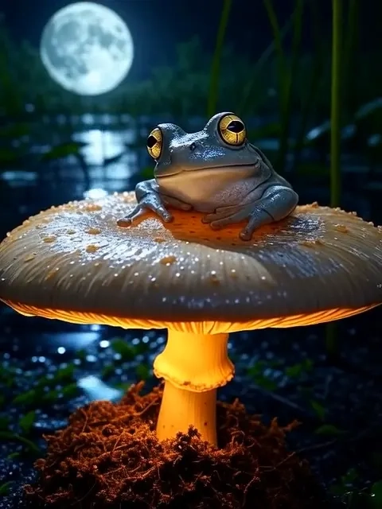
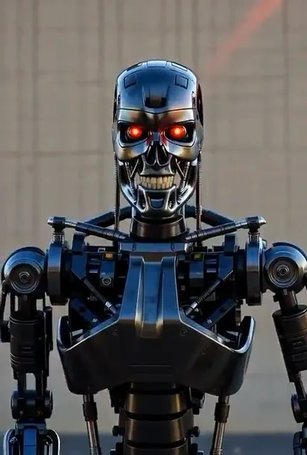
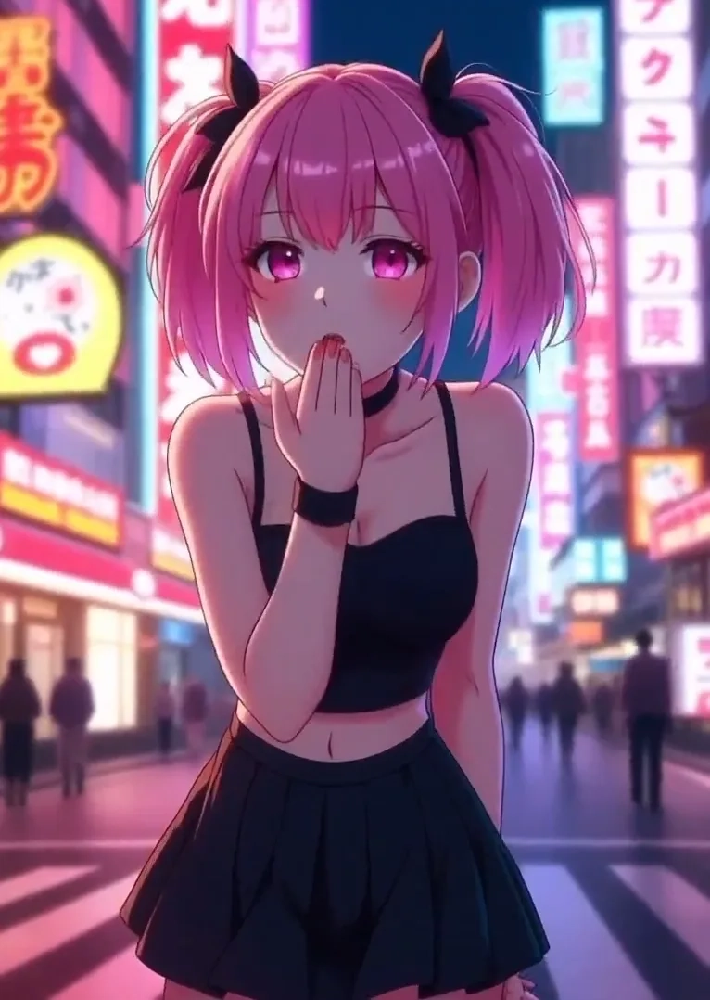
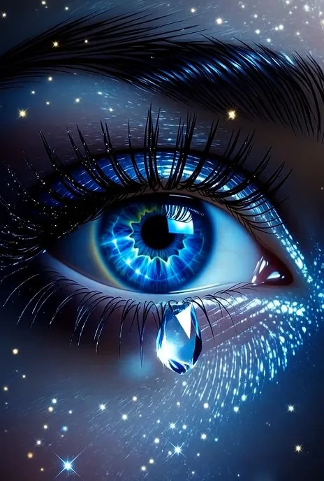
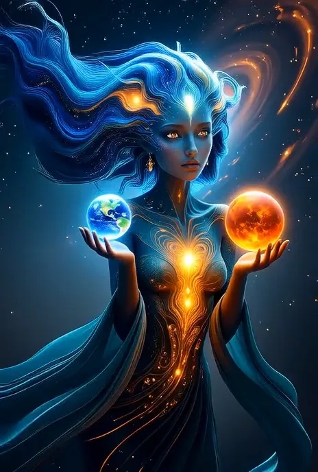
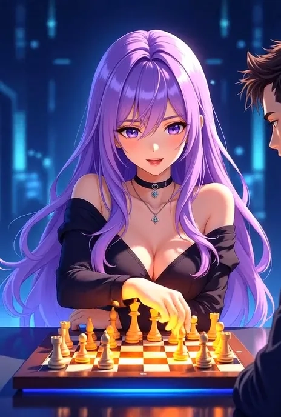

# Grok Video：让你的脑洞变成真视频

---

想象一下，你刚拍了张照片，突然想让它动起来——不是那种粗糙的GIF，而是能发朋友圈、能做广告、能拿去给客户看的专业视频。以前你得学剪辑软件，现在你只需要说句话。Grok Video就是干这个的：上传图片，写一句你想要的效果，60秒后视频就出来了。不需要技术背景，不需要付费订阅，每天免费给你2次机会试手。

---

## Grok Video能做出什么样的视频?

看几个实际案例你就明白了。

这些视频都是用户上传静态图片后，通过简单的文字描述生成的。从产品展示到创意短片，从社交媒体内容到商业演示，基本上你能想到的场景都能做。

## 三步搞定，真的只要三步

**第一步：上传图片**  
手机相册、电脑文件夹、随便哪儿的照片都行。JPG、PNG、WEBP格式都支持，拖进去就完事。

**第二步：写下你的想法**  
不需要专业术语，就像跟朋友聊天一样说。比如"让这个人微笑并眨眼"，或者"让背景的云慢慢飘动"。AI会理解你的意思。

**第三步：等60秒下载**  
大多数视频不到一分钟就能生成。复杂一点的动画可能要两分钟。做好了会提醒你，直接下载就行。

如果你觉得麻烦想直接看效果，👉 [Grok Super会员一个月成品号能让你跳过所有等待，立即体验完整功能](https://shaoyumi.com/buy/66)。毕竟时间就是钱，尤其是对做内容创作的人来说。

## 为什么选Grok Video而不是其他工具?

**速度够快**  
60秒出片，不是夸张。你去泡杯咖啡回来，视频就做好了。

**门槛够低**  
不需要看教程，不需要学软件。会打字就会用。输入框里写句话，剩下的交给AI。

**质量够硬**  
4K分辨率导出，放大屏幕上也不虚。无论是发社交媒体还是做商业演示，画质都够用。

**格式够全**  
社交媒体、广告投放、PPT演示、创意短片——不同平台不同需求，都能适配。

**玩法够多**  
照片动起来、文字变视频、AI跳舞视频，只要你想得出来，基本都能做。

**限制够少**  
从真实场景到幻想世界，想拍什么风格都行。不像有些工具这不让做那不让做。

## 免费额度怎么用?

每天午夜(UTC时间)自动刷新2个免费点数。一个视频消耗1-5个点数，取决于复杂度。点数不累积，用不完就浪费了，所以每天记得来用。

用完了怎么办? 要么等第二天刷新，要么升级付费套餐。付费用户每月100-500点数不等，看你选哪个档位。

如果你需要长期稳定使用，不想每天惦记着免费额度，👉 [不如直接买个Grok Super会员一个月成品号，点数充足还省心](https://shaoyumi.com/buy/66)。

## 什么图片效果最好?

JPG、PNG、WEBP、GIF都能用，但想要最好的效果，记住几点：
- 分辨率至少1024x1024像素
- 主体清晰，别糊
- 光线好，别太暗或太亮

照片质量越高,生成的视频越自然。

## 真实用户怎么说?

目前平台上有5万多活跃用户，累计生成了200多万个视频，覆盖15个以上行业。用户评分4.9/5。

不信的话可以去X(原Twitter)搜"Grok imagine"，能看到一大堆真实用户的分享。有人用来做产品宣传视频，有人用来做创意短片，还有人用来给自家宠物照片加特效——反正各种脑洞都有。

## 常见问题快速解答

**Grok Video到底怎么工作的?**  
上传图片+写文字描述→AI理解你的意思→生成对应的动态视频。整个过程自动化，你只管提需求。

**每天2个免费点数够用吗?**  
如果只是偶尔玩玩或者测试效果，够了。但如果你做内容创作或者商业用途，肯定不够。那就得考虑付费套餐了。

**生成速度真的有那么快?**  
大部分视频30-60秒。复杂动画可能要2分钟。比你自己剪辑快多了。

**可以做哪些类型的视频?**  
图片动画、文字生成视频、AI舞蹈视频、产品展示、创意短片——基本上你能想到的都能做。社交媒体内容、营销素材、演示PPT、艺术创作都适用。

**如果点数用完了怎么办?**  
等第二天刷新,或者升级付费计划。付费用户根据套餐不同,每月有100-500点数。

**支持哪些图片格式?**  
JPG、PNG、WEBP、GIF都行。建议用高分辨率图片(至少1024x1024),主体清晰、光线充足的照片效果最好。

---

## 总结

Grok Video的核心优势就是简单快速。不需要学复杂的剪辑软件,不需要花钱请设计师,自己上传图片、写句话、等一分钟就能拿到专业视频。每天2个免费额度让你零成本试错,做出满意的作品再考虑付费也不迟。

如果你经常需要生成视频内容,或者想跳过所有试用限制直接体验完整功能,👉 [Grok Super会员一个月成品号(质保30天)是最直接的选择](https://shaoyumi.com/buy/66)——点数充足、功能全开、稳定可靠,适合长期使用的创作者和商业用户。
